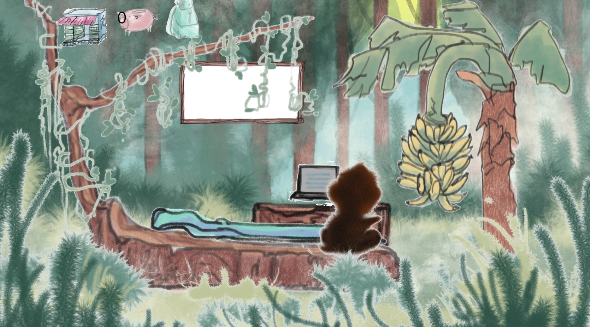
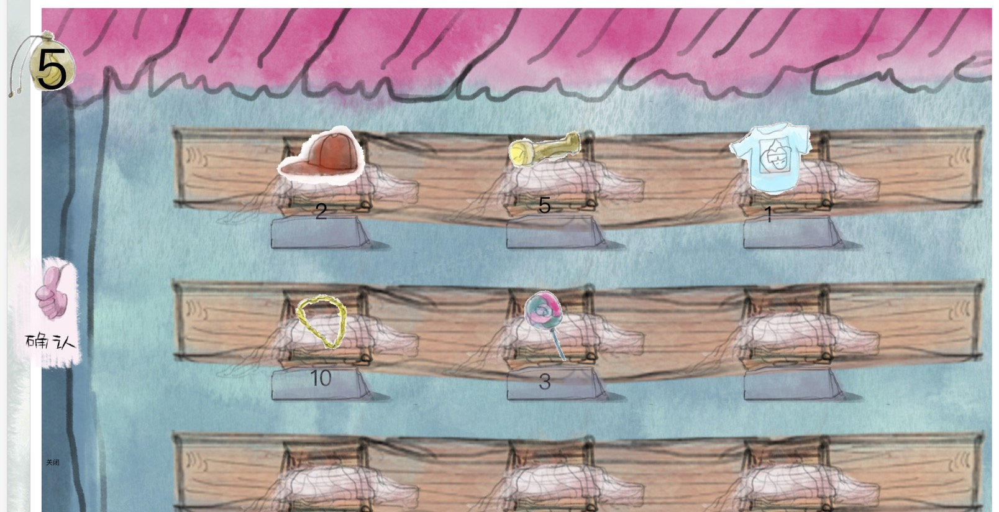
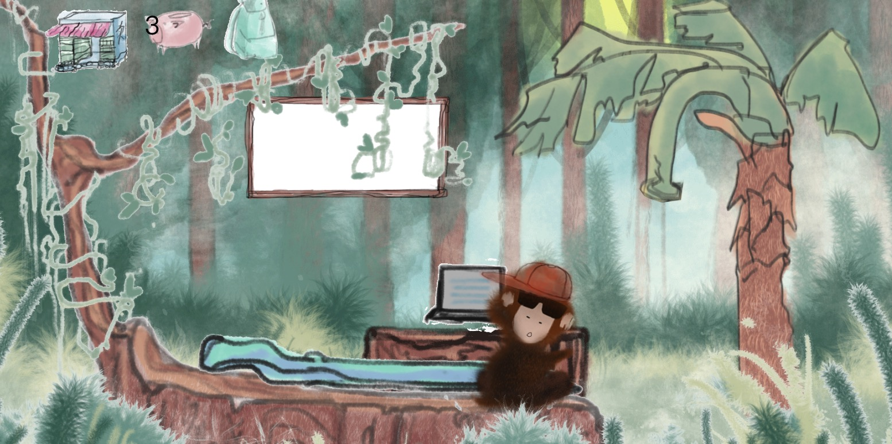
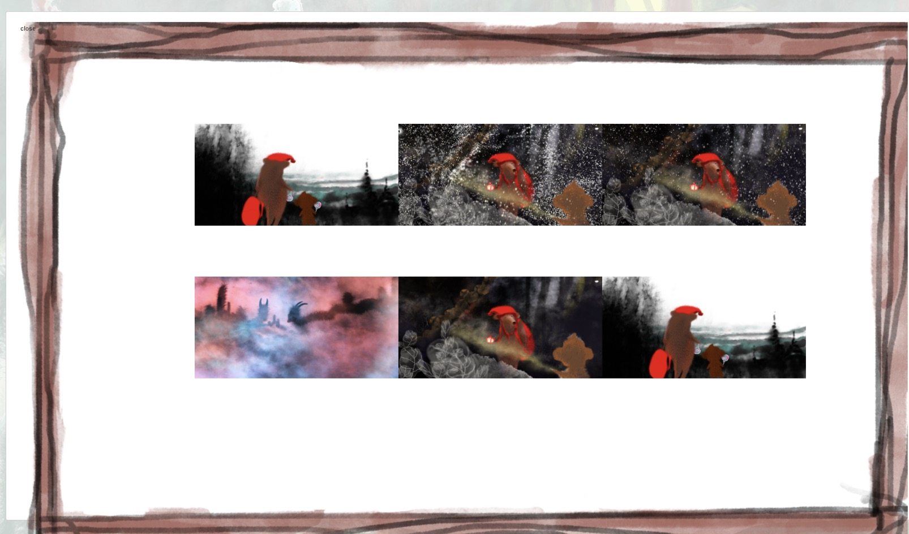
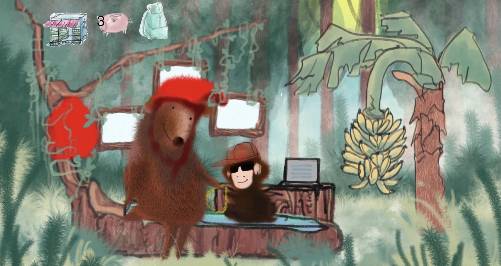

# TravelMonkey开发文档

## TravelMonkey
* 简介

    TravelMonkey(旅行猴),是一款基于Nervos的AppChain开发的一款纯手绘区块链佛性游戏，travel monkey也是游戏的主人公，一只喜欢旅行的猴子，调皮的小猴子就像家长们的孩子一样，喜欢偷偷背着主人做事，喜欢发脾气甚至离家出走，为了让自己的孩子开心，玩家可以买各种东西讨好自己的宠物。小猴子怕主人担心，在旅途中也会给主人寄回来明信片，小猴子在旅途中会认识各种各样的好朋友，也有可能会带回家里面做客，下面我们看下具体玩法。

> 注意: 该文档针对对区块链有一定了解的开发者，且对智能合约有一定了解

## 运行环境

* MacOs 10.14
* Node  10.10.0
* Npm   6.4.1
* Vim   8.0

## 安装

* [node安装](https://nodejs.org/en/download/)
* [npm安装](https://www.npmjs.com/)


## 运行

* 项目克隆到本地

```bash
$ git clone https://github.com/MrPaoBrother/Travel_Monkey.git

$ cd Travel_Monkey
```

* 安装相关依赖

```bash
$ npm i

```
> 安装完成之后，项目根目录下会看到多出了```node_modules```文件.

* 项目运行

```bash
$ npm run start
Starting the development server...
```

> 可能会看到一堆的warning， 没关系， 只要没有Error就行, 有一些是对依赖库版本的警告

* 最后打开浏览器运行 ```http://localhost:3000/```


## 效果展示

* 玩家领养猴子



* 玩家商城购物



* 猴子和玩家交互



* 小猴子出去旅行后 照片墙



* 小猴子把朋友带回家




